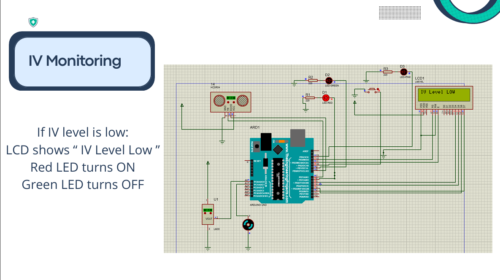
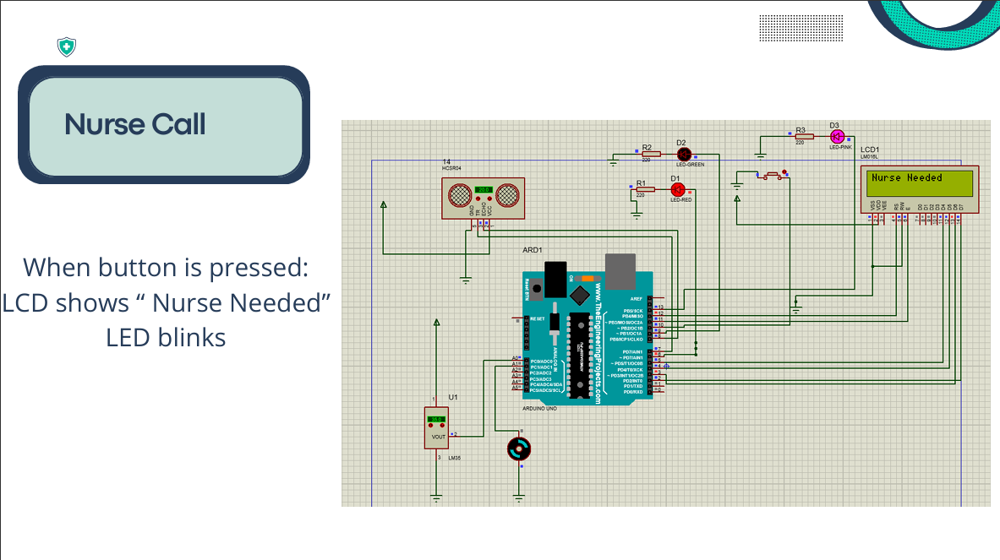
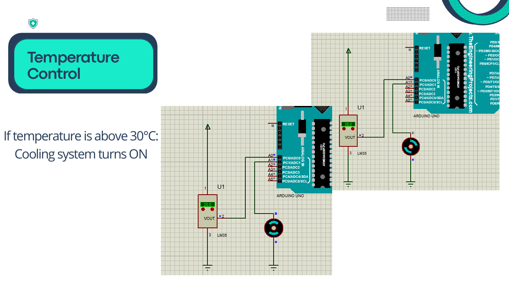
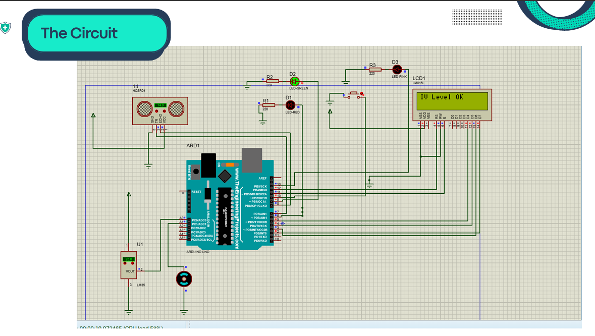

# 🏥 Smart Hospital Room System

A Smart Hospital Room System developed using Arduino Uno to improve patient monitoring and room management.

The system monitors IV fluid level and room temperature, provides a nurse call function, displays system status on an LCD, and controls LEDs automatically.

---

## 📌 Features

- 💧 IV Level Monitoring
  - Displays "IV Level OK" when the IV level is normal.
  - Displays "IV Level Low" when the IV level is low.
  - Green LED indicates normal status.
  - Red LED indicates low IV level.

- 🌡️ Temperature Monitoring
  - Monitors room temperature.
  - Turns the cooling system ON when the temperature exceeds 30°C.

- 🏥 Nurse Call
  - Push button to request assistance.
  - LCD displays "Nurse Needed".
  - Nurse LED blinks when the button is pressed.

- 📟 LCD Display
  - Displays all system status messages in real time.

---

## 🛠 Components Used

- Arduino Uno
- LCD Display
- Ultrasonic Sensor
- LM35 Temperature Sensor
- LEDs
- Cooling Fan
- Push Button
- Resistors
- Jumper Wires

---

## 💻 Software

- MikroC
- Proteus

---

## 📁 Project Structure
Smart-Hospital-Room-System/
│
├── Code/
├── Proteus/
├── Images/
├── Report/
└── README.md

---

## 📷 Project Preview

### IV Monitoring

### Nurse Call

### Temperature Control

### Circuit Design

---

## 🎯 Project Outcome

The project demonstrates how Arduino can be used to simulate a smart hospital room by integrating sensors and simple automation techniques to improve patient monitoring and room control.

---

## 👩‍💻 Author

Amna Bettar
